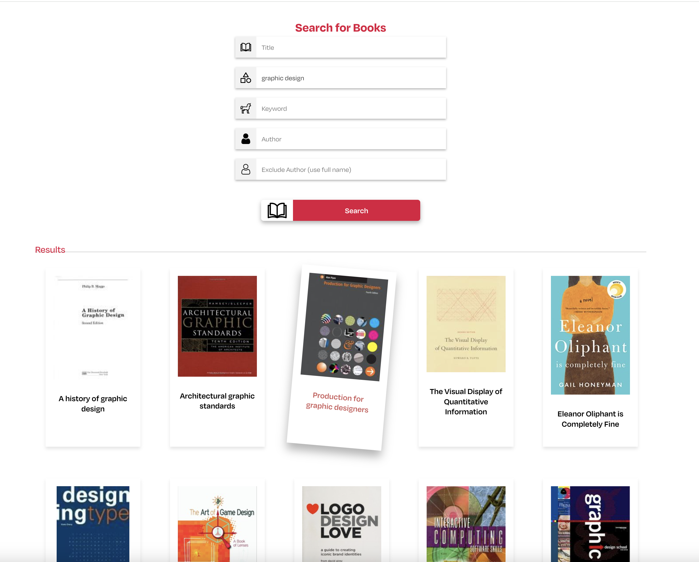

[Adobe XD design files](https://xd.adobe.com/view/c8248d74-c1a0-4a77-994c-a5f5009ac048-9d77/) <br>
[ViBo GitHub repository](https://github.com/laurenhg/vibo)


# ViBo

## Table of Contents

- [About this Project](#about-this-project)
- [Requirements](#requirements)
- [Installation](#installation)
- [Getting Started](#getting-started)



## About this Project
 


Welcome to the GitHub repository for ViBo, my project developed during the [NOVI Hogeschool bootcamp for Full Stack Developer](https://www.novi.nl/full-stack-developer/) - Frontend course. This application serves as a virtual bookshelf that allows users to explore, save, and manage books sourced through the [Open Library API](https://openlibrary.org/developers/api) and the NOVI Educational Backend (https://novi.datavortex.nl).
For a closer look at the design and layout of ViBo, check out the project's [Adobe XD design files](https://xd.adobe.com/view/c8248d74-c1a0-4a77-994c-a5f5009ac048-9d77/).

With this application, users can:

- Create a user account by registering and logging in
- See their user account and change their password (logged-in users only)
- Login and logout
- View a display of 25 random books each time they log in
- Search for books based on selection criteria such as title, subject, keyword, author, and excluding author
- View additional information about any book including title, author, date of publication, language, page count, subjects, and description
- Search for authors by name and view additional information about an author including photo, biographical information, and a selected list of published works
- Save any book of interest to their virtual bookshelf
- Remove any book from their virtual bookshelf

## Requirements

### Runtime environment

[Node.js](https://nodejs.org/en/download) is required to install and run this project on your local machine.

#### API

This project uses the [OpenLibraryAPI](https://openlibrary.org/developers/api). No API keys are needed.

#### Backend

The [NOVI Educational Backend](https://novi.datavortex.nl) was provided by [NOVI Hogeschool](https://www.novi.nl/). No API keys are needed.
If you wish to use your own API key, you'll need to pair it with `AuthContext.jsx`.

## Installation

1. Download and install [Node.js](https://nodejs.org/en/download).
2. Download and install the latest version of [npm](https://www.npmjs.com/).


```
npm install -g npm@latest
```

3. Clone the ViBo repository 

```
https://github.com/laurenhg/vibo
```
or: 
```
git@github.com:laurenhg/vibo.git
```

4. Install npm packages:

```
npm install
```

### Getting Started
#### Available npm commands 

`npm run dev`<br>
Runs the app in development mode.

`npm run build`<br>
Triggers the build process.

`npm run lint`<br>
Starts the linting process.

`npm run preview`<br>
Runs a preview based on a build.

#### Test Account 

You can create your own test account by registering and logging in or use the following credentials: 

```
username: ViboTest
password: ViboTest1234!
```

